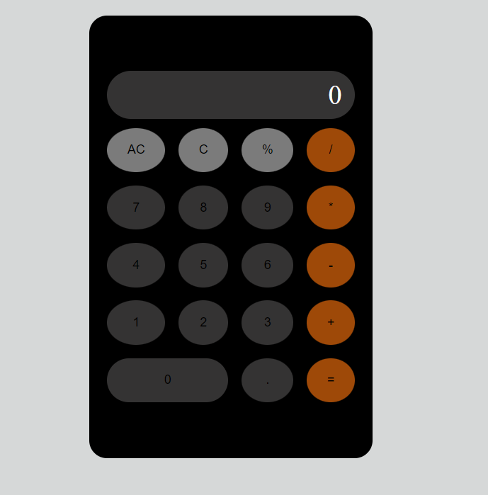

# Калькулятор

<a href='https://dmitriy9427.github.io/calculator-js/' target='_blank'>Ссылка для просмотра</a>



### Стэк:

- HTML5
- CSS3
- JS

## Функциональность

- Сложение
- Вычитание
- Деление
- Умножение
- Вывод процента от числа
- Сброс данных

### Инструкция по установке:

**Склонируйте репозиторий к себе на компьютер**

```
git clone https://github.com/dmitriy9427/calculator-js.git
```

**Запустите у себя в редакторе кода с помощью Live Server**
